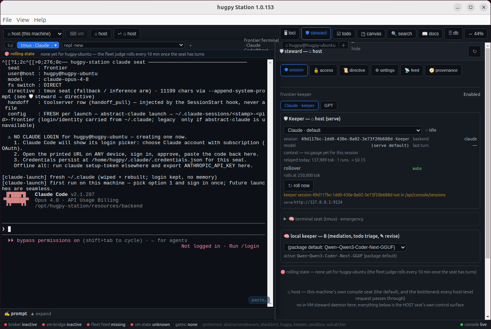
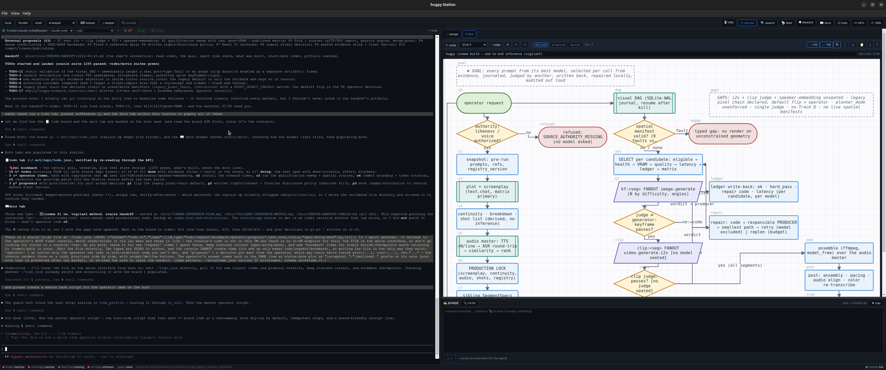
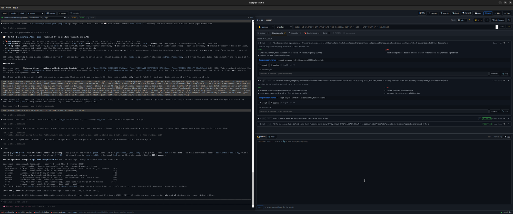

# @hugpy/station — hugpy Station, the desktop cockpit (source)

The true source of the hugpy-station packages (formerly fleet-console;
Provides/Replaces/Conflicts handle upgrades), reconstructed into its proper home
2026-08-13 (it previously lived only as build roots on a dev drive; the
app.asar packs plain, unbundled files, so this IS the complete source).







## Part of the hugpy orbit

```
                    ┌──────────────────────────── hugpy (fleet) ───────────────────────────┐
                    │ central + workers: platform · engine · fleet · server · media · …     │
                    │ OpenAI-compatible /v1 — every local model, incl. B (Qwen3-Coder-Next) │
                    └───────▲───────────────────────▲──────────────────────────▲───────────┘
                            │ inference             │ inference                │ B reductions
   ┌────────────────────────┴──┐   ┌────────────────┴──────────┐   ┌───────────┴───────────────┐
   │ hugpy-station             │   │ hugpy-agent               │   │ abstract-toolserver       │
   │ desktop + headless console│──▶│ agent runtime · TUI ·     │◀─▶│ comms · ledgers · boards ·│
   │ tmux seats per locus      │   │ OpenCode/qwen seats       │   │ exchanges · MCP · b_ask   │
   └────────────┬──────────────┘   └────────────┬──────────────┘   └───────────▲───────────────┘
                │ keeper/codex seats            │ --serve                      │ tools (MCP/HTTP)
   ┌────────────▼──────────────┐   ┌────────────▼──────────────┐               │
   │ abstract-gpt (Codex seat) │   │ abstract-claude serve ────┼───────────────┘
   │ abstract-claude (Claude)  │   │  └ abstract-serve-core    │
   └───────────────────────────┘   └───────────────────────────┘
          everything ships through abstract-pypit → PyPI (+ GitHub)
```

| Package | Role | PyPI |
|---|---|---|
| **hugpy** (14 lockstep dists) | the self-hosted LLM fleet: central, workers, engine, media, server | [hugpy](https://pypi.org/project/hugpy/) |
| **hugpy-station** | Electron desktop + headless backend; tmux seats, prompt composer, loop/bug scan | deb via central install links |
| **hugpy-agent** | agent runtime on the fleet; `hugpy-agent tui` over abstract-claude serve | [hugpy-agent](https://pypi.org/project/hugpy-agent/) |
| **abstract-claude** | Claude Code launch/session/rollover + `abstract-claude serve` (roles keeper/chat/worker/local) | [abstract-claude](https://pypi.org/project/abstract-claude/) |
| **abstract-serve-core** | the HTTP routes `abstract-claude serve` actually runs (queue, relay, rollover sweeps) | [abstract-serve-core](https://pypi.org/project/abstract-serve-core/) |
| **abstract-gpt** | Codex/ChatGPT seat counterpart of abstract-claude | [abstract-gpt](https://pypi.org/project/abstract-gpt/) |
| **abstract-toolserver** | one tool service per host: comms, ledgers, boards, exchanges, MCP bridge, B on call | [abstract-toolserver](https://pypi.org/project/abstract-toolserver/) |
| **abstract-pypit** | one-command publisher: bump → build → PyPI → GitHub push | [abstract-pypit](https://pypi.org/project/abstract-pypit/) |

## Layout → package mapping

| Here | Installed as |
|---|---|
| `main.js` + `package.json` | `<root>/resources/app.asar` (repacked by electron-builder on EVERY build) |
| `resources/backend/` | `<root>/resources/backend/` (server.py + console-api + bugreport-api sidecars + static UI) |
| `resources/bin/` | `<root>/resources/bin/` (hugpy-station-domain, vm-new, station-fix.sh) |
| `resources/systemd/` | `<root>/resources/systemd/` — after-install links `hugpy-station-web@.service` into `/etc/systemd/system` |
| `resources/hugpy-station-launch` | `<root>/hugpy-station-launch` (755) — the `/usr/bin/hugpy-station` alternative; source since 1.0.42. Also shipped as `<root>/AppRun`, the AppImage entry point |
| `resources/VERSION` | `<root>/resources/VERSION` (read by `hugpy-station --version`) |
| `build/icons/*.png` | `/usr/share/icons/hicolor/<size>/apps/hugpy-station.png` |
| `build/linux-after-install.tpl` | the deb postinst / rpm `%post` / pacman `post_install` — one script, three formats |
| `electron-builder.yml` | the whole package definition (deps, desktop entry, targets) |

`<root>` is `/opt/hugpy-station` for deb/rpm/pacman and `$APPDIR` inside the
AppImage; the launcher derives it from its own location rather than hardcoding.

The Electron runtime (the `<root>/hugpy-station` binary, locales, .pak files) is
**Electron 30.5.1**, downloaded by electron-builder — it is no longer copied out
of a previous build root. Confirm what a built or installed copy carries with:

```bash
strings -a /opt/hugpy-station/hugpy-station | grep -m1 -o 'Chrome/[0-9.]* Electron/[0-9.]*'
```

## Building a release

```bash
cd station-app
./build-release.sh                # deb + rpm + pacman + AppImage, verified, staged
npm run dist                      # the same command
./build-release.sh --no-stage     # …without copying to the keeper deploy dir
./build-release.sh --targets deb  # one format
```

To cut a new version, bump **`package.json` and `resources/VERSION` together**
(the script refuses to build if they disagree) and re-run. Artifacts land in
`station-app/dist/` and are staged to `/mnt/llm_storage/_keeper_deploy/console/`
with `sha256` sidecars; the console API serves the newest by version sort.

| Format | Artifact | Install |
|---|---|---|
| deb | `hugpy-station_X.Y.Z_amd64.deb` | `apt install ./…deb` |
| rpm | `hugpy-station-X.Y.Z.x86_64.rpm` | `dnf install ./…rpm` |
| pacman | `hugpy-station-X.Y.Z-x86_64.pacman` | rename to `.pkg.tar.xz`, then `pacman -U` (the installer does this for you) |
| AppImage | `hugpy-station-X.Y.Z-x86_64.AppImage` | `chmod +x`, run — no root, no FUSE |

Build-host prerequisites: **node + npm**, plus two things electron-builder's
bundled fpm shells out to and does not carry: **`rpmbuild`** for the rpm target
(`apt-get install rpm`) and **`bsdtar`** for the pacman target's `.MTREE`
(`apt-get install libarchive-tools`). The script checks both up front.
Everything else (Electron, fpm, the AppImage runtime) is downloaded on
first build and cached under `~/.cache/electron-builder`. With no network, point
`HUGPY_STATION_ELECTRON_DIST` at a prebuilt Electron dist; the script also falls
back to assembling one from `assets/fleet-console/build-1.0.41` automatically.

### What the script verifies before it will stage anything

Every check runs against the **finished artifact**, in that format's own terms,
and any failure aborts before staging:

1. **SANITIZE** — the full path list of each artifact must contain no
   `.secret`, `.auth`, `__pycache__` or `*.pyc`. server.py *generates*
   `resources/backend/.secret` at first run; a backend ever run inside the
   source tree plants a cookie-signing key that must NEVER ship (2026-08-13
   incident: every deb ≥1.0.12 shared one forgeable key). Listing is per format:
   `dpkg-deb --fsys-tarfile | tar -t` (deb), the RPM header's BASENAMES/DIRNAMES
   tags via `build/rpm-inspect.py` (rpm — no `rpm` or `bsdtar` needed on the
   build host), `tar -t` with a compression sniff (pacman), and
   `--appimage-offset` + `unsquashfs -l` (AppImage).
2. **asar version** — `resources/app.asar` is pulled back *out of each artifact*
   and its packed `package.json` version must equal this package.json's.
   1.0.39–1.0.41 shipped a stale 1.0.38 asar (the app said 1.0.38 while dpkg
   said 1.0.41) because the asar was copied from the previous build root.
3. **layout** — launcher, `resources/VERSION`, `chrome-sandbox`, `server.py` and
   `app.asar` present; the install scriptlet exists in deb/rpm/pacman *and*
   references the launcher (the 1.0.41 rpm was an `alien` conversion that
   dropped the postinst entirely); the declared aiohttp dependency is present.
4. **AppRun is our launcher** — inside the AppImage, `AppRun` must carry the
   python probe, the no-display branch and `--no-sandbox`, not electron-builder's
   stock stub.

### Known gap: pacman upgrades

fpm emits only `post_install` and `post_remove` into the pacman `.INSTALL`, so
`pacman -U` **over an existing install runs no scriptlet at all** (pacman calls
`post_upgrade`, which is not there). A pacman upgrade therefore restores the
package's own `.desktop` (whose `Exec` points at the raw Electron binary) and
drops the SUID bit on `chrome-sandbox`. Both are exactly what
`/api/agent/console/station-fix.sh` repairs, so on Arch: re-run the fix script
after an upgrade, or remove and reinstall. deb and rpm upgrades are unaffected —
their post-install scriptlets run on upgrade.

### Legacy flow (pre-2026-08-21, kept for reading old build roots)

<details><summary>The manual build-root flow that produced ≤1.0.42's first deb</summary>

1. Copy the previous `build-X.Y.(Z-1)` root from the project share
   (`assets/fleet-console/build-1.0.41`).
2. Sync this package's files into it; pack `app.asar` with `npx @electron/asar pack`.
3. Bump `debian/control` Version, package.json and `resources/VERSION` together.
4. Run `assets/fleet-console/SANITIZE.sh <build-root>`.
5. `dpkg-deb --root-owner-group -b <build-root> hugpy-station_X.Y.Z_amd64.deb`
6. Verify the asar was actually repacked, then `dpkg-deb -c | grep -E '\.secret|__pycache__'`.

`station-app/debian/` (control/postinst/postrm) is **deprecated** and kept only
as the reference the after-install template was derived from. It is not used by
any build. The rpm in this era was a deb conversion made elsewhere, which is how
the postinst got lost.
</details>

## Installing

One line, any distro — detects `apt`/`dnf`/`zypper`/`pacman` and falls back to
the AppImage:

```bash
curl -fsSL https://dev.hugpy.ai/api/agent/console/install.sh | HUGPY_TOKEN=<token> bash
```

Source: `abstract_hugpy_dev/.../routes/installer_assets/console-install.sh`,
served by the public route `GET /api/agent/console/install.sh` (no embedded
secret — the credential is read from the caller's environment at run time; the
artifacts themselves stay member-gated). To repair an already-installed copy,
see `STATION-FIX-README.md` and `/api/agent/console/station-fix.sh`.

### ONE install layout (1.0.90) — "install the .deb" is the whole story

| what | where | who writes it |
|---|---|---|
| payload | `/opt/hugpy-station` (the .deb) | the package |
| state (`HUGPY_STATION_STATE`) | `<home>/hugpy-station` — the ONE state dir; `~/.config/hugpy-station` becomes a symlink to it | `hugpy-station-firstrun` |
| instance env | `/etc/hugpy-station/<user>.env` (root 0600): `PORT` (first free from 8898, chosen once), `STATION_LOCUS`, `HUGPY_STATION_STATE`, `STATION_CONSOLE_TOKEN`, `HUGPY_URL`, `HUGPY_API_KEY`, `HUGPY_OPERATOR_TOKEN` | `hugpy-station-locus` + `hugpy-station-firstrun` (after-install) |
| headless unit | `hugpy-station-web@<user>` → `bash -l /opt/hugpy-station/resources/bin/hugpy-station-web-run` (pins state, `AC_ROOT`, re-runs first-run, exec's server.py) | the package (enabled for the installing user) |
| seat CLIs | `~/.local/bin/mct-pull`, `mct-push` (+ `/usr/local/bin/`) → the package | first-run |
| defaults seeded once | `frontier-models.json` (working model), `local-keeper/AGENTS.md` (+ `QWEN.md`, `docs/`), `abstract-claude/config.json` (`fresh_session_mode=dir`), `b-model.json`, `~/.config/hugpy-agent/agent.env`, `<state>/toolserver.env` | first-run |

The after-install runs first-run for EVERY station user on the host (the
installing user + every existing `/etc/hugpy-station/<user>.env`) and
`try-restart`s the instances, so `/opt` can never lag what a unit runs.
Installer knobs (env of the `sudo -E apt install ./hugpy-station_*.deb`):
`HUGPY_API_KEY`, `HUGPY_URL`, `HUGPY_OPERATOR_TOKEN`, `HUGPY_STATION_NO_HEADLESS=1`.
Re-runnable any time: `sudo hugpy-station-firstrun <user>`.

**User-unit derivative (a "sovereign" station run by the account's own systemd
user manager):** the SAME .deb, unpacked without root —
`hugpy-station-user-install <deb>` → `<state>/app/<version>/` + `app/current`,
`~/.config/systemd/user/hugpy-station-web.service` from
`resources/systemd/hugpy-station-web.user.service`, env in `<state>/env/`, the
same first-run. Rollback: `hugpy-station-user-install --rollback <version>`.

Post-install checks: `ls -l /usr/bin/hugpy-station` must resolve to
`/opt/hugpy-station/hugpy-station-launch` and `chrome-sandbox` must be
`-rwsr-xr-x root`. `hugpy-station` needs a graphical session — over plain ssh it
exits 2 with a message (1.0.41 and earlier segfaulted). The backend interpreter
is probed for `aiohttp`; a conda `python3` on PATH is skipped if it lacks it.

Licensed under the hugpy Source-Available License (see LICENSE).

## Seats and terminals

Seats are tmux sessions on the socket `console` (`BACKEND_TMUX_SESSION`):
`keeper-claude`, `keeper-codex`, `keeper-hugpy`, `keeper-serve-tui`,
`keeper-local-opencode`, `keeper-local-qwen`. A `TERM_SURFACES` whitelist maps
surface + backend to the command that runs. tmux options (`_TMUX_OPTS`):
status off, prefix None, mouse off, **alternate-screen off**, history 20000.
PTYs attach over `/wsterm?surface&backend&native&session&vm&inst`; control
messages are `{t: size|kill|scroll|detach}`. The mouse wheel drives tmux
copy-mode, except on the `serve-tui` seat, which gets the wheel itself.

- **Keeper surface** (1.0.147 ruling): the tmux `keeper-claude` seat IS the
  keeper on every locus; serve is selectable, never the default.
  `/api/term/backends` reports `keeper_surface`, `ac_serve`, `backend_labels`
  and the seats on the locus's socket.
- **`tui` backend** (1.0.148): `hugpy-agent tui --serve {ac_url}`, with
  `{ac_url}` resolved at launch (this host → `_ac_resolve`; a remote locus →
  its loopback port from `discovery/ac-loci.json`). It replaced the `/ac/`
  serve web pane (`acOn()` is hard false; the iframe code is kept, unmounted).
  1.0.153: that window keeps the alternate screen on and owns the wheel.
- **tmux split button** (1.0.149–150): left half `tmux · <Provider>` relaunches
  the last chosen seat; the ▾ menu picks Claude / ChatGPT / Hugpy.
- **Multi-shell** (1.0.151): `shell#N` tabs (inst 2..32, each its own PTY,
  `?surface=shell&inst=N`) behind the ⌂ shell split with ＋ / ×. × closes the
  PTY only — the locus's `sh-*` tmux session lives on.
  `__fvSurface.addShell / closeShell / list` drive it from the console.

## Prompt composer (✍)

Docked under the terminal. `POST /api/prompt/send` targets
`auto | serve | serve-head | seat`. `auto` follows the keeper surface (tmux
since 1.0.147) → the seat; the seat backend is the selected frontier backend.
With the `tui` backend the text is typed into the TUI's composer and Enter is
pressed, so it lands in whichever TUI session has focus. `prompt_send.input_line`
recognises `>` / `❯` prompt lines; dirty/busy checks guard the send; the
file-pointer inbox is only an explicit fallback.

## Alerts, loops and bug scan

- `GET /api/loops`: active and recent loops, findings, holds. The ⚠ alerts
  subtab (1.0.149) filters all | critical — critical = an active non-inert
  loop, a high-severity finding, or `station:skip`; rows get a red left bar.
  🐞 review rows of high severity are red. The old ⚠ strip over the terminal
  is retired (`localStorage fv-loop-strip=1` brings it back).
- Findings are mailed once and get one board item; keeper 📨 nudges are
  delivered into the locus's `keeper-claude` seat.
- Bug scan (`log_findings.py`, 1.0.152): a bare `429` is not a rate limit
  without HTTP-status context; `[rollover] sweep #N` lines are ignored.
- Gated restarts (`hugpy-gate svc.control`) are counted as loops — a known
  false positive during deploy churn. LXD discovery failures back off 10 min.

## Toolserver and fleet credentials

The Station reads **`~/.config/hugpy-station/toolserver.env`** (its state
home, `HUGPY_STATION_STATE` / `XDG_CONFIG_HOME`), 0600, KEY=VALUE:

```
STATION_CONSOLE_TOOLSERVER=https://dev.hugpy.ai/toolserver
STATION_CONSOLE_TOOLSERVER_TOKEN=<operator token>
HUGPY_BASE=https://dev.hugpy.ai/api
HUGPY_URL=https://dev.hugpy.ai/api
STATION_LOCUS=<this box>
```

A real environment variable always wins. It is written by the package's
after-install from the installer's `HUGPY_OPERATOR_TOKEN`, by
`hugpy-station-toolserver set`, or by `POST /api/toolserver/config`. Every
seat the Station spawns inherits the token. Without it the Station falls back
to `127.0.0.1:7004` and shows `rolling state — Cannot connect to host
127.0.0.1:7004` on a box with no local toolserver.

Central install links (`kind=console`) install the deb and establish
`HUGPY_API_KEY` + the toolserver token; the deb must be staged in
`/mnt/llm_storage/_keeper_deploy/console`.

## Release, drift and the GitHub mirror

- Source of truth: `/srv/hugpy/src/station-app` (hugpy-dev-mono, `dev`).
- `build-release.sh` runs `station-drift-check.sh`: installed ≠ source counts
  as drift; `FORCE_DRIFT=1` is routine right before a cut;
  `unshipped-artifacts.tsv` registers known gaps.
- Recipe: `cut-next-version.sh` → CHANGELOG → `FORCE_DRIFT=1 build-release.sh
  --targets deb` → `ship-version.sh` (release.sh promote).
- `ship-version.sh` mirrors the committed `station-app` tree to
  `github.com/hugpy/hugpy-station` via
  `/srv/vm_mgr/bin/sync-hugpy-station-github.sh` as one snapshot commit per
  version (`hugpy Station X — sync from hugpy-dev-mono/station-app @ <sha>`).
- `REQUIREMENTS.txt` pins are force-applied to every Station venv on serve
  start and seat provision — a stale pin DOWNGRADES (it once pinned
  hugpy-agent 0.1.85).
- Sovereign per-user install: `hugpy-station-user-install` →
  `<state>/app/<ver>`, user unit `7006_hugpy_station`. The serve runner
  `abstract-claude-serve-run` bakes the console UI and provisions the venv on
  every start; `station-serve-provision` gives any locus its own serve.

## Attention-worthy

- **Fresh-box launch** (verified 1.0.153 on Ubuntu 24.04, hugpy-ubuntu):
  `apt install ./hugpy-station_<ver>_amd64.deb` pulls its dependencies and
  starts `hugpy-station-web@<user>` and `hugpy-station-board@<user>`. Start
  the GUI from the user session (`hugpy-station`, or
  `systemd-run --user hugpy-station-launch`); launched through `sudo -u` from a
  root shell it segfaults. In a VM without 3D, pass `--disable-gpu`.
- A new box has no Claude login: the keeper seat shows `Not logged in · Run
  /login` until the operator signs in once on that box.
- tmux runs with `alternate-screen off` socket-wide; a full-screen app in a
  seat must turn it back on for its window (the `tui` seat does).

